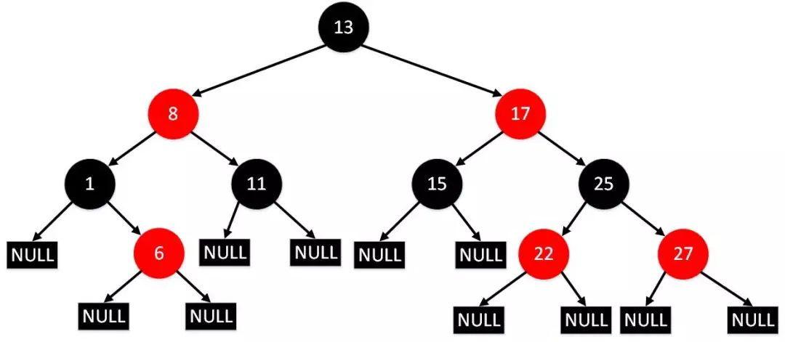
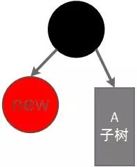
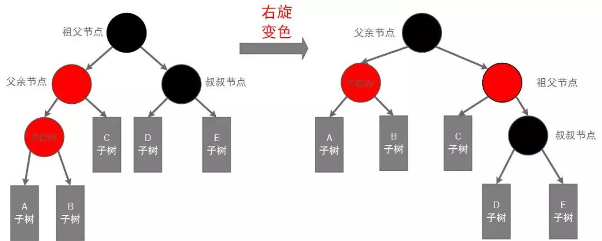
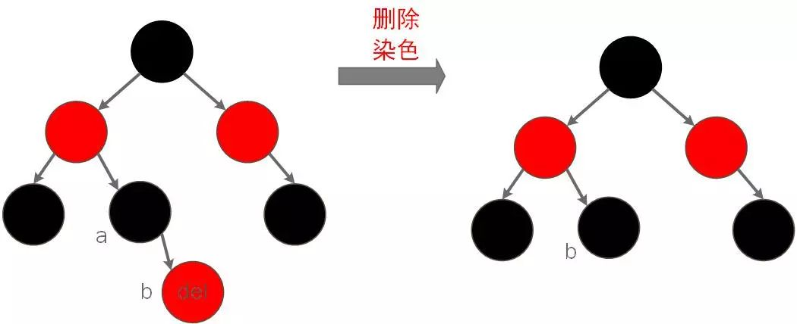
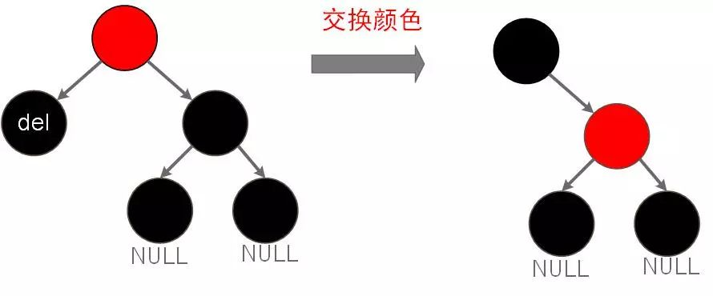
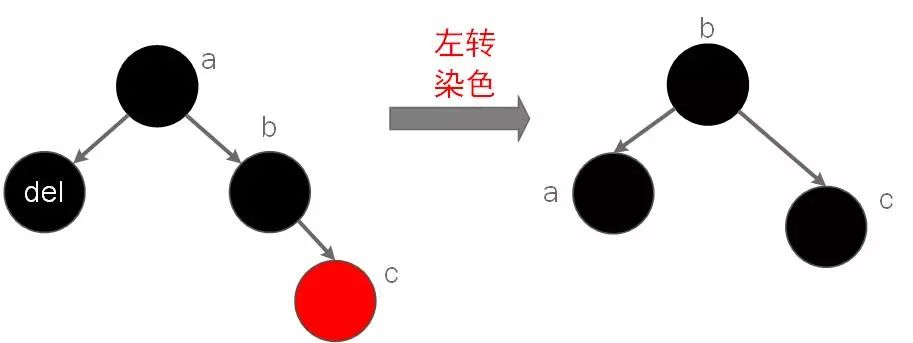

### 红黑树的性质

普通的二叉查找树在极端的情况下可退化成链表，此时的查找效率会比较低下。为了避免这种情况，就出现了一些自平衡的查找树，比如AVL、红黑树等。这些自平衡的查找树通过定义一些性质，将任意结点的左右子树高度差控制在固定范围内，以达到平衡状态。红黑树需要满足如下五条性质：

- 节点是红色或者黑色

> 如上图，在树里面的结点不是红色就是黑色，没有其他颜色，这也就是红黑树的由来。

- 根节点是黑色

> 根节点总是黑色的，不能为红。

- 每个叶节点（NULL或空节点）是黑色

> 如上图，NULL节点是个空节点，并且是黑色的。

- 每个红色节点的两个子节点都是黑色的

> 连续的两个节点的意思就是父节点与子节点不能是连续的红色

- 从任一节点到其每个叶子的所有简单路径都包含相同数目的黑色节点（简称黑高）

> 上图中，从根节点到每一个NULL节点的路径中，都包含了相同数量的黑色节点。

这五条性质约束了红黑树，可以通过数学来证明，满足这五条性质的二叉树，就可以保证任意节点到其每个叶子节点路径最长不会超过最短路径的2倍。证明如下：

当某条路径最短时，这条路径比如都是黑色节点构成。当某条路径长度最长时，这条路径必然是由红色和黑色节点相间构成（性质4限定了不能出现两个连续的红色节点）。而性质5又限定了从任一节点到其每个叶子节点的所有路径必须包含相同数量的黑色节点。此时，在路径最长的情况下，路径上红色节点数量 = 黑色节点数量。该路径长度为黑色节点数量的2倍，也就是最短路径长度的2倍。

### 红黑树的操作

红黑树的基本操作与其他树的操作一样，有查找、插入和删除等操作。由于查找与其他树的操作一样，比较简单，而插入、删除操作比较复杂，这里主要就是接受插入、删除操作。

#### 1.旋转操作

由于插入、删除的过程中都要涉及到旋转，这里首先介绍一下旋转这个基本操作。旋转操作分为左旋转和右旋转

**左旋**左旋的过程是将节点x的右子树绕节点x逆时针旋转，使得节点x的右子树成为x的父亲，同时修改修改相关节点的引用。旋转之后，二叉查找树的属性仍然满足。

**右旋**右旋的过程是将节点x的左子树绕x顺时针旋转，使得节点x的左子树成为x的父亲，同时修改相关节点的引用。旋转之后，二叉查找树的属性仍然满足。

#### 2.插入操作

红黑树的插入过程和二叉查找树的插入过程基本类似，不同的地方在于，红黑树插入新节点后，需要进行调整，以满足红黑树的性质。在讨论红黑树的插入操作之前必须要明白，任何一个即将插入的新节点的初始颜色都为红色。原因很简单，引入插入黑色的节点会增加某条路径上黑节点的数目，从而导致整棵树黑高度的不平衡。但如果插入的节点是红色的，此时所有路径上的黑色节点数量不变，仅可能会出现两个连续的红色节点的情况。这种情况下，通过变色和旋转进行调整即可，比插入黑色的简单多了。

红黑树的插入可能遇到如下几种情况：

- 情况1：当插入的节点是根节点时，直接涂黑即可；
- 情况2：当要插入的节点的父节点是黑色的时候，这个时候插入一个红色的节点并没有对这五个性质产生破坏。所以直接插入不用在进行调整操作。

- 情况3：如果要插入的节点的父节点是红色且叔叔节点也是红色。由于父节点和插入的节点都是红色，所以性质4被打破，此时需要进行调整。在这种情况下，先将父节点和叔叔节点的颜色染成黑色，再让祖父结点染成红色。此时经过祖父结点的路径上的黑色节点数量不变，性质5仍然满足。但需要注意的是祖父节点被染成红色后，可能会和它的父节点形成连续的红色节点，此时需要递归向上调整。

- 情况4：当要插入的父节点为红色，叔叔节点为黑色。此时需要对父节点进行左旋，然后按照情况5进行处理（注：这里要插入的节点有可能是调整后的其它节点，这里我们理解父节点为插入节点而转到情况5）。

- 情况5：当要插入的父节点为红色，叔叔节点为黑色。插入节点是父节点的左孩子，且父节点是祖父节点的左孩子。此时对祖父节点进行右旋，并将祖父节点和父节点进行互换颜色。这时候满足了红黑树的全部性质。

#### 3.删除操作

相对于插入操作，红黑树的删除操作更为复杂。同样，这里我们也分为几种情况进行分析：

- 情况1：当被删除元素为红时，对五条性质都没有什么影响，直接删除即可。
- 情况2：当被删除元素为黑且为根节点时，直接删除。
- 情况3：当被删除元素为黑，且有一个右子节点为红时，将右子节点涂黑放到被删除元素的位置，如图：

- 情况4：当被删除元素为黑，且兄弟节点为黑，兄弟节点两个孩子也为黑，父节点为红，此时，交换兄弟节点与父节点的颜色；NULL元素是指每个叶节点都是两个空的元素，颜色为黑的NULL元素，需要他的时候就可以把它看成两个黑元素，不需要的时候就可以忽视它。

- 情况5：当被删除的元素为黑、并且为父节点的左支，且兄弟颜色为黑，兄弟的右支为红色，这个时候需要交换兄弟与父亲的颜色，并把富且涂黑、兄弟的右支涂黑，并以父节点为中心左转。

- 情况6：当被删除元素为黑、并且为父节点的左支，且兄弟颜色为黑，兄弟的左支为红色，这个时候需要先把兄弟与兄弟的左子节点颜色互换，进行右转，然后就变成了情况5一样，在按照情况5进行旋转。

- 情况7：当被删除元素为黑且为父元素的右支时，跟情况5、情况6互为镜像。
- 情况8：当被删除的元素为黑，且父父元素的左支，兄弟节点为红色的时候，需要交换兄弟节点与父节点的颜色，以父节点进行左旋，就变成了情况4，再按照情况四进行操作即可。

